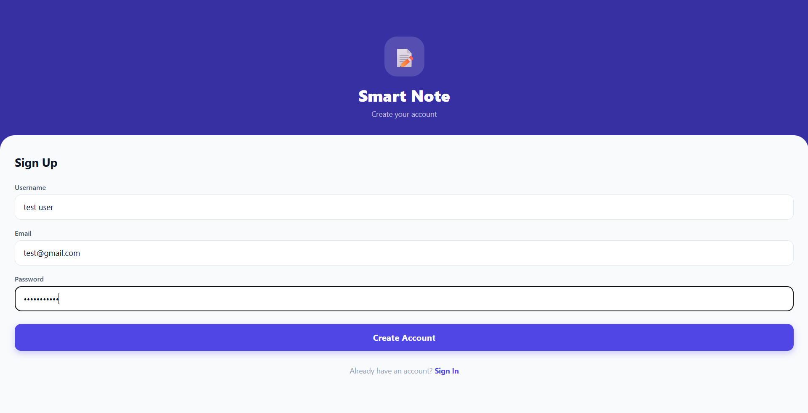
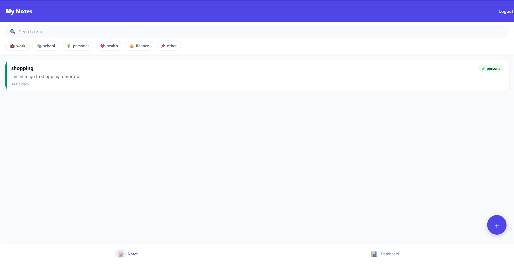
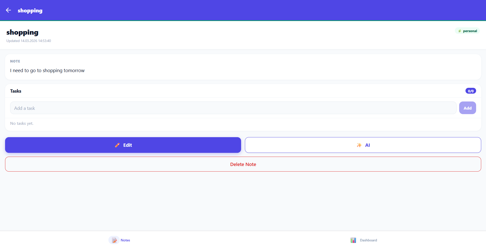
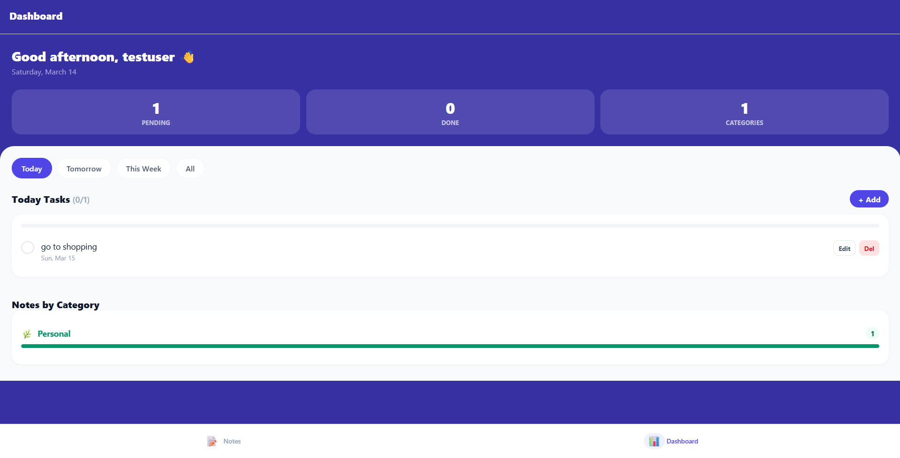
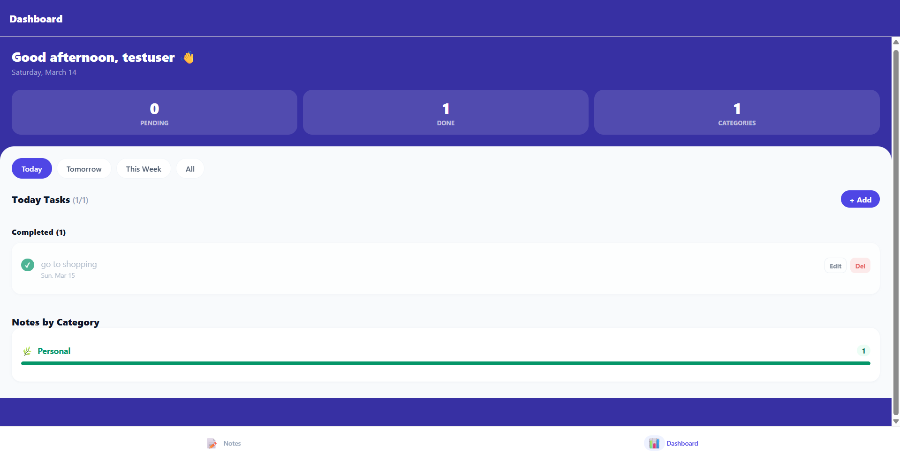

# Smart Note

Smart Note is an AI-powered note and task manager with a FastAPI backend and an Expo React Native frontend.

- Web client on `http://localhost:3000`
- API docs on `http://localhost:8000/docs`
- Mobile support via Expo (Android/iOS)

## Repository Structure

```
smart-note/
├── backend/    # FastAPI + SQLAlchemy + PostgreSQL + Alembic
└── frontend/   # Expo + React Native + TypeScript
```

## Quick Start (Docker, Recommended)

Requires [Docker Desktop](https://www.docker.com/products/docker-desktop/).

```bash
git clone https://github.com/yusufbasli/smart-note.git
cd smart-note
cp backend/.env.example backend/.env
```

Edit `backend/.env` and set only this if you want AI enabled:

```env
OPENAI_API_KEY=sk-...
```

Then run:

```bash
docker compose up --build
```

PostgreSQL, backend, migrations, and frontend web app are started automatically.

## Manual Setup

### Backend

```bash
cd backend
pip install -r requirements.txt
cp .env.example .env
alembic upgrade head
uvicorn app.main:app --reload
```

### Frontend

```bash
cd frontend
npm install
cp .env.example .env
npm run start
```

For web directly:

```bash
npm run web
```

## Validation

Backend tests:

```bash
cd backend
pytest tests/ -q
```

Frontend type check:

```bash
cd frontend
npm run typecheck
```

## Features

- JWT authentication (register/login/me)
- Notes CRUD with search, filters, and pagination
- AI category + summary + task extraction from note content
- Task management under notes and as standalone tasks
- Period filters (`today`, `tomorrow`, `week`, `all`) for dashboard tasks
- Recurring task support with daily completion behavior
- Dockerized local environment

## Example Usage

Use this flow to quickly verify the app after startup:

1. Open `http://localhost:3000` and create an account.
2. Create a note from the `+` button in the notes screen.
3. Open the note detail page and add tasks in the `Tasks` box.
4. Go to `Dashboard` and switch period tabs (`today`, `tomorrow`, `week`, `all`) to view tasks.
5. Mark tasks done, edit them, and delete them from dashboard controls.
6. Trigger AI analysis with the `AI` button on note detail (requires valid OpenAI quota).

Notes:

- If AI returns `503`, check backend logs; the common cause is OpenAI `429 insufficient_quota`.
- Task visibility on dashboard depends on due date + selected period.

## Screenshots

The following screenshots reflect the current web UI flow:

### Register



### Notes List



### Note Detail



### Dashboard (pending)



### Dashboard (completed)



## Tech Stack

| Layer | Technology |
|---|---|
| Backend API | FastAPI, SQLAlchemy 2.x, PostgreSQL |
| Auth | JWT (python-jose) + bcrypt |
| AI | OpenAI GPT-4o-mini |
| Mobile & Web | Expo, React Native, TypeScript |
| Styling | NativeWind |
| State | Zustand + AsyncStorage |

## More Docs

- Backend details: `backend/README.md`
- Frontend details: `frontend/README.md`
